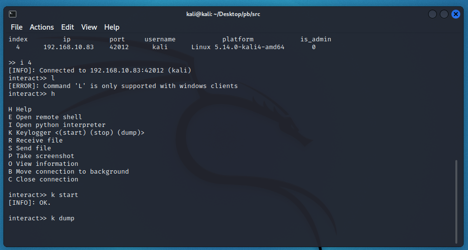

# Python Backdoor

This project is a cross-platform (Windows/Linux/MacOS) yet simple and powerfull backdoor/reverse tcp/RAT made in Python3 which contains many features such as multi-client support.

## Installation

You will need:

* [Python](https://www.python.org/downloads) 
* One of the following
  * Windows (Add python to PATH during installation)
  * MacOS Big Sur or higher (earlier versions may not work with pyinstaller)
  * Linux

1. Download the repository via GitHub or git eg. `git clone https://github.com/xp4xbox/Python-Backdoor`
2. Install the required modules by running `python -m pip install -r requirements.txt`

## Features

Currently, this program has several features, notably:

* Multi-client support
* Cross-platform server and client
* Fernet encryption
* Built-in keylogger
* Ability to send commands to all clients
* Ability to capture screenshots
* Ability to upload/download files
* Ability to open remote shell or python interpreter
* Ability to disable a process*
* Ability to inject shellcode*
* VM/sandboxie check*
* Add to startup*
* Ability to melt file*

> Asterisk means only supported on Windows 

## Quick Usage

1. Open `src/setup.py` in python and configure options to build the client
2. Check the `dist` folder for the binary.
3. Disable your firewall on the server or configure your firewall to allow the port chosen.
4. Run the `src/main_server.py -p <port>` to start the server and accept connections.

> If you plan on using the program with DNS hostname or external IP, you must port forward your chosen port.
> The setup uses tkinter, install if not already installed `eg. sudo apt-get install python3-tk`.

## Common problems & Solutions

- Injecting shellcode requires the architecture specified by the command. eg. x64: `msfvenom windows/x64/meterpreter/reverse_tcp`
- For use outside of network specified port is not open, check specified port with a [port scanner](https://www.whatismyip.com/port-scanner/)
- Keylogger, and screencapture required permissions in MacOS

## Disclaimer

This program is for educational purposes only. I take no responsibility or liability for own personal use.

## License

[License](https://github.com/xp4xbox/Python-Backdoor/blob/master/license)
